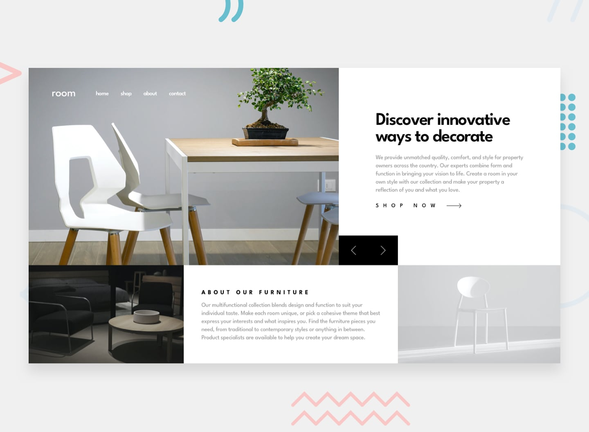

# Frontend Mentor - Room homepage solution

This is a solution to the [Room homepage challenge on Frontend Mentor](https://www.frontendmentor.io/challenges/room-homepage-BtdBY_ENq). Frontend Mentor challenges help you improve your coding skills by building realistic projects. 

## Table of contents

- [Overview](#overview)
  - [The challenge](#the-challenge)
  - [Screenshot](#screenshot)
  - [Links](#links)
- [My process](#my-process)
  - [Built with](#built-with)
  - [Useful links](#useful-links)
- [Author](#author)

## Overview

### The challenge

Users should be able to:

- View the optimal layout depending on screen size
- See hover states for all interactive elements on the page
- Navigate the slider using either their mouse/trackpad or keyboard

### Screenshot

### Links

- Github repo: [https://github.com:Mary2021/room-home-page.git](https://github.com:Mary2021/room-home-page.git)
- Live URL: [https://mary2021.github.io/room-home-page/](https://mary2021.github.io/room-home-page/)

## My process

### Built with

- Semantic HTML5 markup
- CSS custom properties
- CSS Grid
- Getting started with Vite [https://vitejs.dev/guide/](https://vitejs.dev/guide/).
- Install React Bootstrap [https://react-bootstrap.github.io/getting-started/introduction](https://react-bootstrap.github.io/getting-started/introduction)

### Useful links

- [React folder structure](https://blog.webdevsimplified.com/2022-07/react-folder-structure/)
- [Controlling carousel next and previous with custom buttons ](https://github.com/react-bootstrap/react-bootstrap/issues/3245) 
/ https://stackoverflow.com/questions/67459939/how-to-control-react-bootstrap-carousel-with-custom-buttons

## Author

- Website - [Mary P](https://github.com/Mary2021)